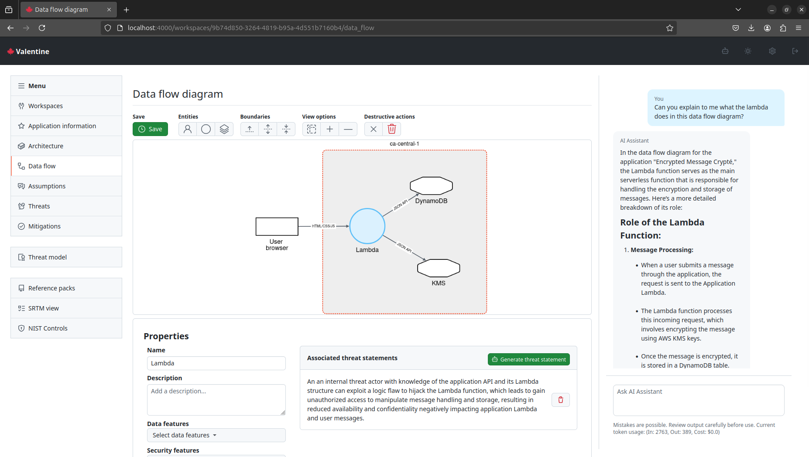

# 🍁 Navigator

[La version française suit.](#---------------------------------------------------------------------)


Navigator is a real-time collaborative threat modeling tool that combines human expertise with generative AI to streamline the security design process while maintaining simplicity and rigor.



IMPORTANT: This project is undergoing active development and may experience breaking changes. This project is also still missing feature and has bugs. Please review the [issues](https://github.com/canada-ca/navigator/issues) for more information. If you have any specific questions, please contact [max.neuvians@cds-snc.ca](mailto:max.neuvians@cds-snc.ca).

NOTE: Navigator should be deployed in an environment with the appropriate safeguards in place to protect the confidentiality, integrity, and availability of the data that will be stored there. For example, before using Navigator to conduct threat modeling and other analysis at the Protected B level, Navigator should be deployed to an environment with security controls in place commesurate with the hosting of that data. Departmental Risk Management processes should be followed, including the completion of a security assessment where required.

## Features

1. Threat modeling with [STRIDE](https://en.wikipedia.org/wiki/STRIDE_model) based on a pre-defined [threat grammar](https://catalog.workshops.aws/threatmodel/en-US/what-can-go-wrong/threat-grammar). For more information see [Threat Composer](https://github.com/awslabs/threat-composer).

2. Collaborative, real-time editing of threat models, data flow diagrams, and application architecture.

3. Generative AI to help assist threat modeling and explain architectures and data flow.

4. Mapping of assumptions and mitigations to NIST controls for easy compliance documentation.

5. Use of shareable reference packs to help establish common assumptions, threats, and mitigation across teams in an organization.

If you prefer images over text you can look at the [gallery](screenshots/GALLERY.md).

## Rationale

Navigator offers an alternative to the compliance-driven security approach commonly practiced in large organizations. In teams following agile development practices, compliance-driven security often creates a bottleneck: controls must either be determined before development begins or after it concludes. This paradigm positions security as an obstacle to development rather than a collaborative partner in the process.

Navigator is built on the premise that a system's attack surface expands primarily through the addition of features and their interactions. While the most secure system [might be the one that does nothing](https://github.com/kelseyhightower/nocode), real-world applications must balance security with functionality. As new features are implemented or system components evolve, the threat model should adapt to reflect both direct threats from new capabilities and emergent threats from feature interactions, environmental changes, and dependencies.

Threat modeling, particularly the STRIDE methodology, provides teams with an accessible framework for identifying and understanding threats throughout the development lifecycle. Through an iterative process, teams can build and maintain a comprehensive threat model that reflects their system's actual architecture, interactions, and environmental context, rather than relying solely on upfront design assumptions.

While Navigator streamlines the threat modeling process, it recognizes that compliance documentation remains a necessary business requirement. Rather than treating compliance as an afterthought or barrier, a key design goal has been to automatically generate documentation from the ongoing threat modeling process. Teams can map assumptions and mitigations to specific NIST controls, and export the resulting documentation for security assessments, making compliance a natural outcome of good security practices.

Navigator's flexibility allows it to be used for threat modeling both individual features and entire systems, without imposing a rigid workflow on teams. This adaptability enables organizations to integrate security thinking into their development process in a way that suits their specific needs and maturity level.

## Quickstart using codespaces
1. [](https://codespaces.new/canada-ca/valentine)
2. `make setup`
3. `make dev`

Note: It is normal to see warnings during the setup process. Also depending on the amount of memory available to the codespace, the setup process may take longer than usual.

## Running with docker compose

You can run the app locally using docker compose. It is not recommended to use this in production.

```
docker compose up
```

will build the latest image and run the app on `http://localhost:4000`. If you would like to use the LLM functionality, you need to provide your own OPENAI API key for `gpt-4o-mini`.

```
OPENAI_API_KEY=sk-proj... docker compose up
```

If you make changes to the source code, then you need to rebuild the image: 

```
docker compose up -d --no-deps --build app
```

## Setup for development

```
cd valentine
mix deps.get
mix ecto.create
mix ecto.migrate
mix run priv/repo/seeds.exs
cd assets
npm i 
```

## OpenSpec workflow

This repository uses OpenSpec for spec-driven development.

- `openspec/specs/` contains the current-state baseline: what the system currently does.
- `openspec/changes/` contains proposed deltas: what a feature or behavior change will modify.
- Main specs in `openspec/specs/` do not need an extra "implemented" marker. If they exist, they describe the currently implemented behavior.
- New feature work should usually start by asking the AI agent to create an OpenSpec change for you, then implementing it, and finally syncing the accepted behavior back into the baseline spec during archive.

Typical agent-driven workflow:

1. Tell your AI: `/opsx:propose <what-you-want-to-build>`.
2. Review the generated change under `openspec/changes/<change-name>/`.
3. Tell your AI to implement the approved change.
4. Tell your AI to archive the change once the code and specs are in sync.


## OpenAI on Azure

You can also use OpenAI on Azure. You need to provide the following environment variables:

```
AZURE_OPENAI_ENDPOINT=
AZURE_OPENAI_KEY=
```

## Optional Auth

You can use several different providers as your IDP if you set the following environment variables:

AWS Cognito:
```
COGNITO_DOMAIN=<your-domain>.amazoncognito.com
COGNITO_CLIENT_ID=your-client-id
COGNITO_CLIENT_SECRET=your-client-secret
COGNITO_USER_POOL_ID=your-user-pool-id
COGNITO_AWS_REGION=your-aws-region
```

Google Auth:
```
GOOGLE_CLIENT_ID=your-client-id
GOOGLE_CLIENT_SECRET=your-client-secret
```

Microsoft Entra ID:
```
MICROSOFT_CLIENT_ID=your-client-id
MICROSOFT_CLIENT_SECRET=your-client-secret
MICROSOFT_TENANT_ID=your-tenant-id
```


In this case to access the `/workspaces` route you need to be authenticated with the IDP, but visiting `/:provider/auth`.

## License

MIT 2025

## ---------------------------------------------------------------------

# Navigator 🍁 

Navigator est un outil collaboratif de modélisation des menaces en temps réel qui associe l’expertise humaine à l’IA générative pour rationaliser le processus de conception de la sécurité tout en conservant simplicité et rigueur.


IMPORTANT : Ce projet est en cours de développement et peut subir des modifications importantes. Il manque encore des fonctionnalités à ce projet et il comporte des bogues. Veuillez examiner les [problèmes](https://github.com/canada-ca/navigator/issues) pour plus de renseignements. Si vous avez des questions spécifiques, veuillez contacter : [max.neuvians@cds-snc.ca](mailto:max.neuvians@cds-snc.ca).

REMARQUE : Navigator doit être déployé dans un environnement doté des mesures de protection appropriées afin de garantir la confidentialité, l'intégrité et la disponibilité des données qui y seront stockées. Par exemple, avant d'utiliser Navigator pour mener des analyses de modélisation des menaces et d'autres analyses au niveau Protégé B, Navigator doit être déployé dans un environnement disposant de contrôles de sécurité proportionnés à l'hébergement de ces données. Les processus de gestion des risques ministériels doivent être suivis, y compris la réalisation d'une évaluation de sécurité lorsque cela est requis.

## Fonctionnalités

1. Modélisation des menaces à l’aide de [STRIDE](https://en.wikipedia.org/wiki/STRIDE_model) sur la base d’une [grammaire des menaces prédéfinie](https://catalog.workshops.aws/threatmodel/en-US/what-can-go-wrong/threat-grammar). Pour de plus amples renseignements, consultez : [Threat Composer](https://github.com/awslabs/threat-composer).

2. Édition collaborative et en temps réel des modèles de menaces, des diagrammes de flux de données et de l’architecture des applications.

3. L’IA générative pour aider à la modélisation des menaces et expliquer les architectures et les flux de données.

4. Mise en correspondance des hypothèses et des mesures d’atténuation avec les contrôles NIST afin de faciliter les documents de la conformité.

5. Utilisation de dossiers de référence partageables pour aider à établir des hypothèses communes, des menaces et des mesures d’atténuation au sein des équipes d’une organisation.

Si vous préférez les images au lieu des textes, vous pouvez consulter la [galerie].

## Justification


Navigator offre une autre option que l’approche de la sécurité axée sur la conformité, souvent pratiquée dans les grandes organisations. Dans les équipes qui suivent des pratiques de développement agiles, la sécurité axée sur la conformité crée souvent un goulot d’étranglement : les contrôles doivent être déterminés soit avant le début du développement, soit après sa conclusion. Ce paradigme place la sécurité comme un obstacle au développement plutôt que comme un partenaire de collaboration dans le processus.

Navigator repose sur le principe que la surface d’attaque d’un système s’étend principalement par l’ajout de fonctionnalités et leurs interactions. Si le système le plus sécurisé [peut-être celui qui ne fait rien](https://github.com/kelseyhightower/nocode), les applications du monde réel doivent trouver un équilibre entre la sécurité et la fonctionnalité. Au fur et à mesure que de nouvelles fonctionnalités sont mises en œuvre ou que les composants du système évoluent, le modèle de menace devrait s’adapter pour refléter à la fois les menaces directes provenant des nouvelles capacités et les menaces émergentes provenant des interactions entre les fonctionnalités, des changements environnementaux et des dépendances.

La modélisation des menaces, en particulier la méthodologie de STRIDE, fournit aux équipes un cadre accessible pour identifier et comprendre les menaces tout au long du cycle de vie du développement. Grâce à un processus itératif, les équipes peuvent construire et maintenir un modèle de menace complet qui reflète l’architecture, les interactions et le contexte environnemental réels de leur système, plutôt que de se fier uniquement à des hypothèses de conception initiales.

Si Navigator rationalise le processus de modélisation des menaces, cet outil reconnaît que les documents de conformité restent une nécessité pour l’organisation. Plutôt que de traiter la conformité comme une réflexion après coup ou comme un obstacle, l’un des principaux objectifs de la conception a été de générer automatiquement des documents à partir du processus de modélisation des menaces en cours. Les équipes peuvent faire correspondre les hypothèses et les mesures d’atténuation aux contrôles précis du NIST et exporter les documents qui en résultent pour les évaluations de sécurité, ce qui fait de la conformité un résultat naturel des bonnes pratiques de sécurité.

La flexibilité de Navigator lui permet d’être utilisé pour la modélisation des menaces, qu’il s’agisse de fonctionnalités individuelles ou de systèmes entiers, sans imposer un flux de travail rigide aux équipes. Cette adaptabilité permet aux organisations d’intégrer l’approche de la sécurité dans leur processus de développement d’une manière qui corresponde à leurs besoins spécifiques et à leur niveau de maturité.

## Relance de système en utilisant GitHub Codespaces

1. [](https://codespaces.new/canada-ca/valentine)
2. `make setup`
3. `make dev`

Note : Il est normal de voir apparaître des avertissements au cours de la procédure d’installation. En outre, cela dépend de la capacité de mémoire disponible dans le Codespace, la procédure d’installation peut prendre plus de temps que d’habitude.


## Exécuter avec docker compose
Vous pouvez exécuter l’application localement en utilisant docker compose. Il n’est pas recommandé de l’utiliser dans le cadre de la production.

```
docker compose up
```
construira la dernière image et exécutera l'application sur `http://localhost:4000`. Si vous souhaitez utiliser la fonctionnalité LLM, vous devez fournir votre propre OPENAI API clé pour `gpt-4o-mini`.

```
OPENAI_API_KEY=sk-proj... docker compose up
```

Si vous apportez des modifications au code source, vous devez alors reconstruire l'image : 

```
docker compose up -d --no-deps --build app
```

## Configuration pour le développement

```
cd valentine
mix deps.get
mix ecto.create
mix ecto.migrate
mix run priv/repo/seeds.exs
cd assets
npm i 
```

## Flux de travail OpenSpec

Ce dépôt utilise OpenSpec pour le développement piloté par les spécifications.

- `openspec/specs/` contient la base de référence de l'état actuel : ce que le système fait aujourd'hui.
- `openspec/changes/` contient les deltas proposés : ce qu'une nouvelle fonctionnalité ou un changement de comportement modifiera.
- Les spécifications principales dans `openspec/specs/` n'ont pas besoin d'un marqueur supplémentaire comme « implemented ». Si elles existent, elles décrivent le comportement déjà en place.
- En général, le travail sur une nouvelle fonctionnalité devrait commencer en demandant à l'agent IA de créer un changement OpenSpec, puis être implémenté, puis synchronisé dans la spécification de référence au moment de l'archivage.

Flux de travail typique avec l'agent :

1. Dites à votre IA : `/opsx:propose <ce-que-vous-voulez-construire>`.
2. Examinez le changement généré dans `openspec/changes/<change-name>/`.
3. Demandez à votre IA d'implémenter le changement approuvé.
4. Demandez à votre IA d'archiver le changement une fois que le code et les spécifications sont synchronisés.

## OpenAI sur Azure 
Vous pouvez également utiliser OpenAI sur Azure. Vous devez fournir les variables d'environnement suivantes :

```
AZURE_OPENAI_ENDPOINT=
AZURE_OPENAI_KEY=
```

## Authentification facultative

Vous pouvez utiliser différents fournisseurs d'identité (IDP) si vous définissez les variables d'environnement suivantes :

AWS Cognito:
```
COGNITO_DOMAIN=<votre-domaine>.amazoncognito.com
COGNITO_CLIENT_ID=vote-client-id
COGNITO_CLIENT_SECRET=votre-client-secret
COGNITO_USER_POOL_ID=votre-user-pool-id
COGNITO_AWS_REGION=votre-aws-region
```

Google Auth :
```
GOOGLE_CLIENT_ID=votre-client-id
GOOGLE_CLIENT_SECRET=votre-client-secret
```

Microsoft Entra ID:
```
MICROSOFT_CLIENT_ID=votre-client-id
MICROSOFT_CLIENT_SECRET=votre-client-secret
MICROSOFT_TENANT_ID=votre-tenant-id
```

Dans ce cas, pour accéder à la route `/workspaces`, vous devez vous authentifier avec l'IDP en visitant `/:provider/auth`.

## Licence

MIT 2025
